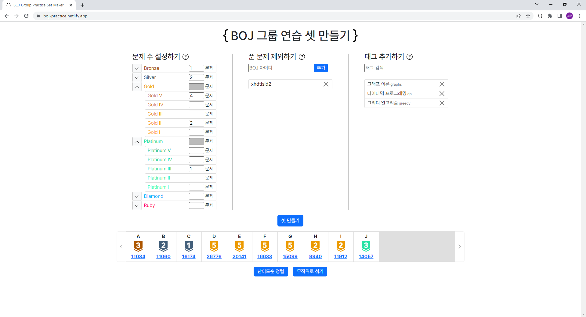
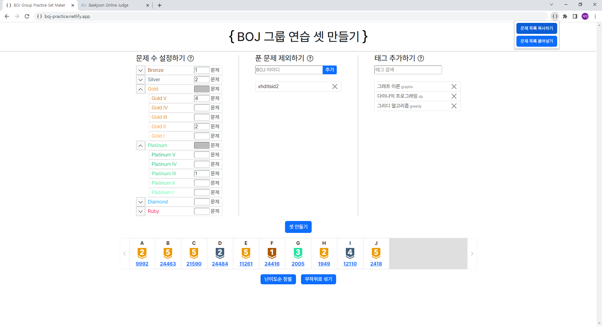
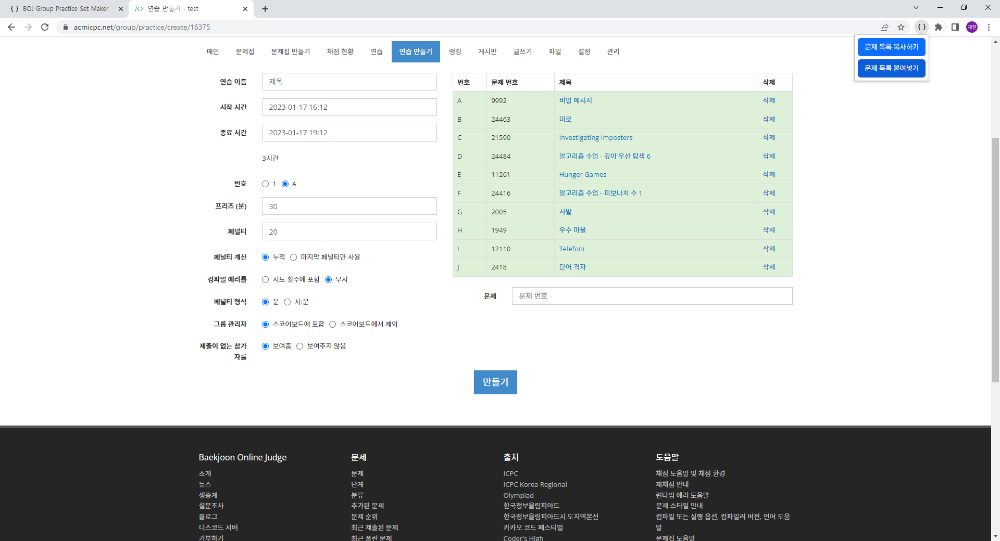

# BOJ Practice Set Maker

[boj-practice.netlify.app](https://boj-practice.netlify.app)

백준 그룹 연습에 사용할 문제 셋을 간편하게 만들 수 있는 사이트입니다.

난이도별 문제 수, 이미 푼 문제 제외, 알고리즘 분류(태그)를 설정할 수 있습니다.

예를 들어, 아래 조건을 만족하는 셋을 만들고 싶은 경우,
<ul>
    <li><code>브론즈 1문제</code> + <code>실버 2문제</code> + <code>골드Ⅴ 4문제</code> + <code>골드Ⅱ 2문제</code> + <code>플래티넘Ⅲ 1문제</code></li>
    <li><code>xhdtlsid2</code>가 푼 문제 제외</li>
    <li><code>그래프 이론</code>, <code>다이나믹 프로그래밍</code>, <code>그리디 알고리즘</code> 중 적어도 하나의 태그를 갖는 문제</li>
</ul>

아래 화면과 같이 셋을 만들 수 있습니다.

문제들을 난이도순으로 정렬하거나, 무작위로 섞는 것도 가능합니다.

## (크롬 웹스토어 출시 대기 중)BOJ Practice Problem Adder

셋을 만들고 나서 문제들을 하나씩 하나씩 연습에 추가하는 것이 번거롭다면, 크롬 확장 프로그램 BOJ Practice Problem Adder를 이용하여 몇 번의 클릭 만으로 모든 문제를 한꺼번에 추가할 수 있습니다.

먼저 셋을 만들고, 화면 우측 상단의 BOJ Practice Problem Adder 아이콘을 클릭했을 때 나타나는 `문제 목록 복사하기` 버튼을 클릭합니다. 아이콘이 보이지 않는다면, 우측 상단의 퍼즐 모양 아이콘을 클릭하고 BOJ Practice Problem Adder를 고정합니다.

그 다음 백준의 연습 만들기 창을 연 뒤(다른 탭이나 다른 창에서 열어도 괜찮습니다), BOJ Practice Problem Adder 아이콘을 클릭하고 `문제 목록 붙여넣기`버튼을 클릭하면 문제들이 추가됩니다. 문제들이 추가되는 순서는 셋 문제 목록에서의 순서와 동일합니다.

## 개발자 연락처

버그 제보 및 기타 문의 사항은 [xhdtlsid2@gmail.com](mailto:xhdtlsid2@gmail.com)으로 연락 주시면 감사하겠습니다.